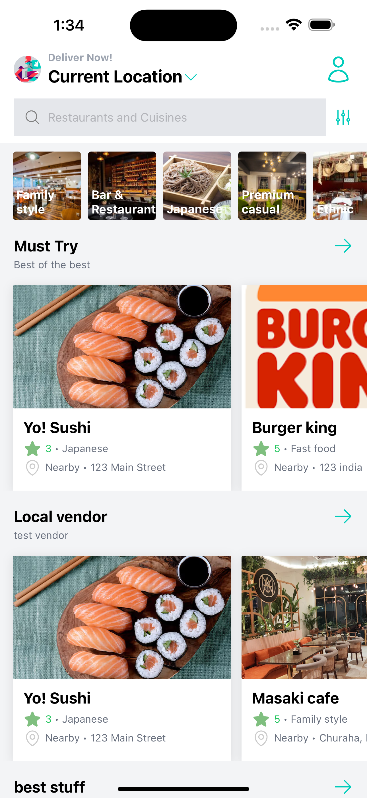
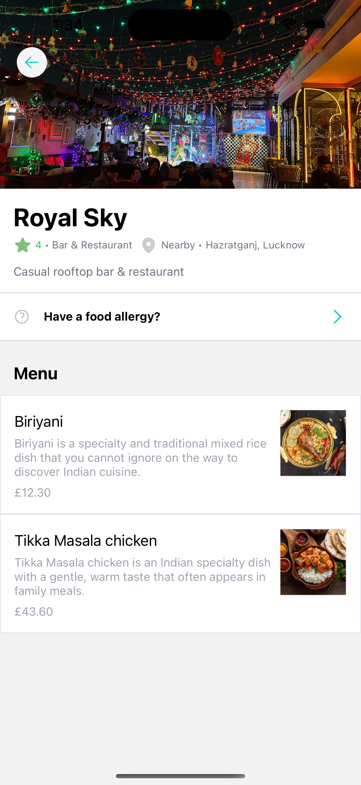
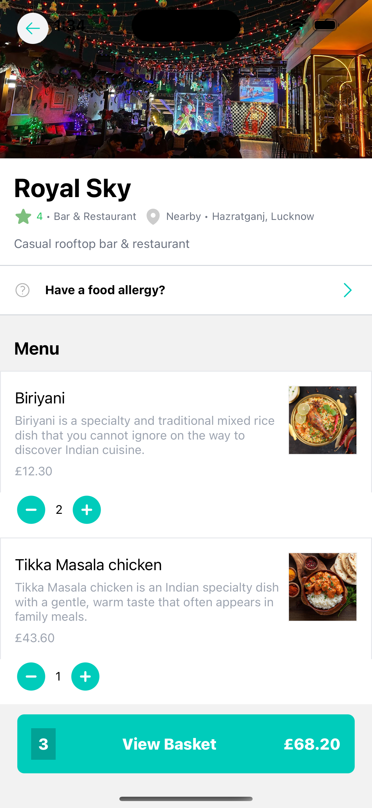
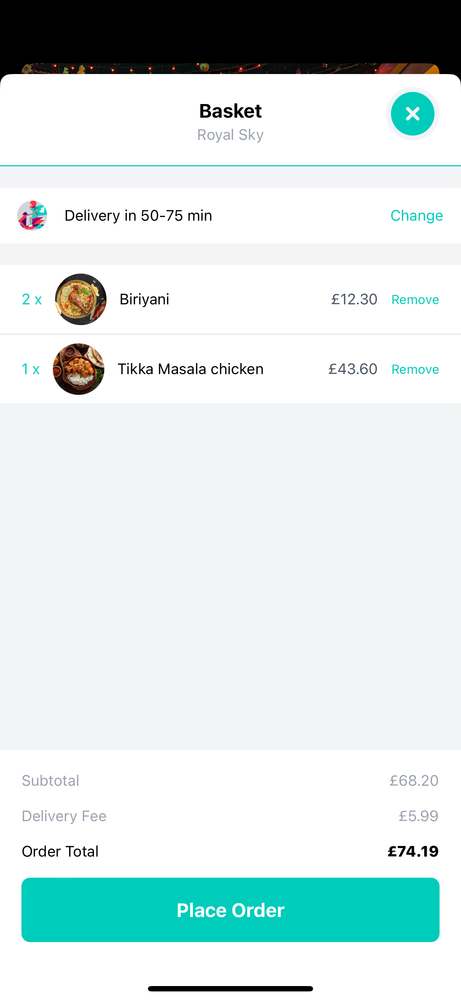
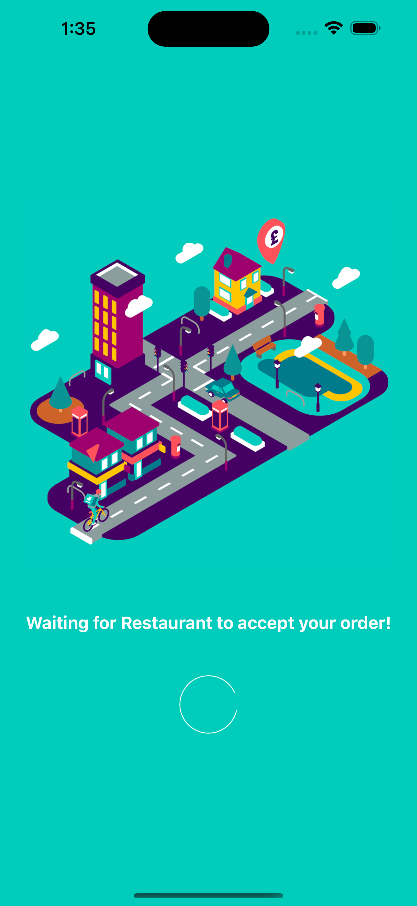
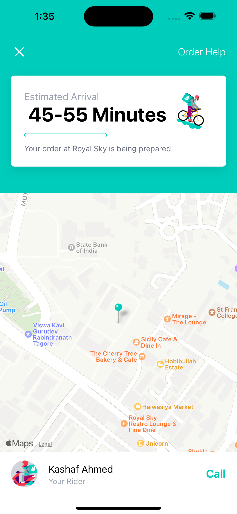

# Deliveroo Clone App


## Screenshots

  
_Home Screen: The main landing page where users can start their food ordering journey._`

  
_Restaurant Screen: Displays details about a selected restaurant including its menu._

  
_With Basket Screen: Shows the user's current selections in the basket before checkout._

  
_Basket Screen: Allows users to review and edit items in their basket._

  
_Place Order Screen: Where users wait before restaurant accepts the order._

  
_Delivery Screen: Provides real-time updates on the delivery status of the order._

## Video


_App Demo GIF: Watch a full demo of the app in action._

## Overview

This repository contains the source code for a React Native application that serves as a clone of the Deliveroo app. The application is designed to run on both iOS and Android platforms. It utilizes Sanity.io as the backend service to manage and deliver content dynamically.

## Features

- Browse restaurants and different cuisines.
- Add and remove items from the basket.
- View detailed information about each restaurant and their offerings.
- Real-time order tracking on a map interface.
- Responsive and user-friendly interfaces optimized for mobile devices.

## Technologies Used

- **React Native**: A framework for building native apps using React.
- **Sanity.io**: Backend service used for handling and querying data.
- **Redux Toolkit**: State management library.
- **React Navigation**: Library to handle routing and navigation in the app.

## Getting Started

### Prerequisites

- Node.js
- npm or yarn
- React Native CLI
- Android Studio or Xcode (for iOS)

### Installation

1. Clone the repository:
   ```bash
   git clone https://github.com/your-repository/deliveroo-clone.git
   ```
2. Navigate to the project directory:
   ```bash
   cd deliveroo-clone
   ```
3. Install dependencies:
   ```bash
   npm install
   ```
   or
   ```bash
   yarn install
   ```
4. Run the project:
   - For iOS:
     ```bash
     npx react-native run-ios
     ```
   - For Android:
     ```bash
     npx react-native run-android
     ```

Author: Kashaf Ahmed  
Email: kashafaahmed@gmail.com
